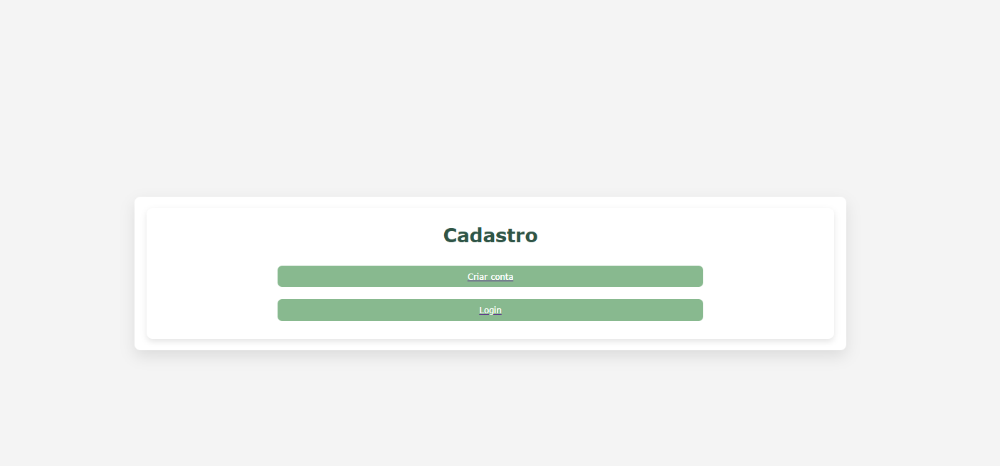
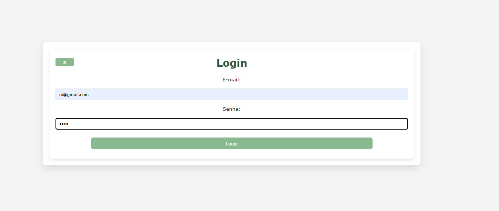
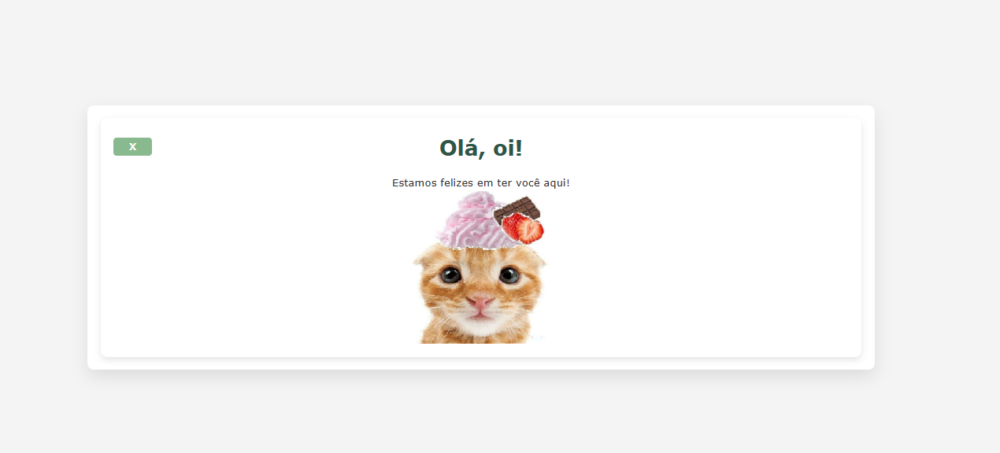

# CRUD Flask
Este projeto consiste no desenvolvimento de uma API CRUD básica utilizando Flask, com integração a um banco de dados PostgreSQL por meio do SQLAlchemy. A aplicação foi implementada no formato de um site simples de cadastro e login, permitindo a criação, leitura, atualização e exclusão de registros.

## Funcionalidades
- Cadastro de usuários
- Sistema de login
- Criação de registros
- Visualização de dados cadastrados
- Atualização de informações
- Exclusão de registros

## Project Workflow
O desenvolvimento do projeto seguiu o seguinte fluxo de construção:

1. **Estruturação do projeto** – organização das pastas e configuração inicial da aplicação Flask.  
2. **Modelagem do banco de dados** – criação das entidades e conexão com o PostgreSQL utilizando SQLAlchemy.  
3. **Implementação do CRUD** – desenvolvimento das rotas para criação, leitura, atualização e exclusão de registros.  
4. **Sistema de autenticação** – implementação de funcionalidades básicas de cadastro e login de usuários.  
5. **Interface web** – criação de páginas HTML para interação com o sistema.  
6. **Testes e ajustes** – verificação do funcionamento das rotas, formulários e integração com o banco de dados.

## Resultados

## Ferramentas Utilizadas
* Python  
* Flask  
* SQLAlchemy  
* PostgreSQL  
* HTML/CSS  

## Competencias Demonstradas
Desenvolvimento web com Flask, integração de aplicações Python com bancos de dados relacionais (PostgreSQL) utilizando SQLAlchemy, implementação de operações CRUD para gerenciamento de dados e desenvolvimento de interfaces web básicas com HTML e CSS, evidenciando habilidades na construção e estruturação de aplicações web completas.

